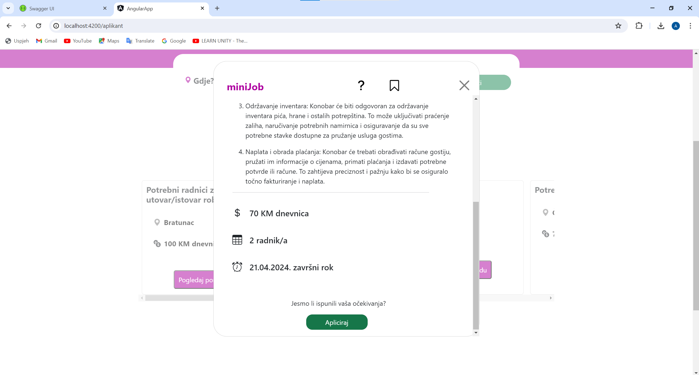
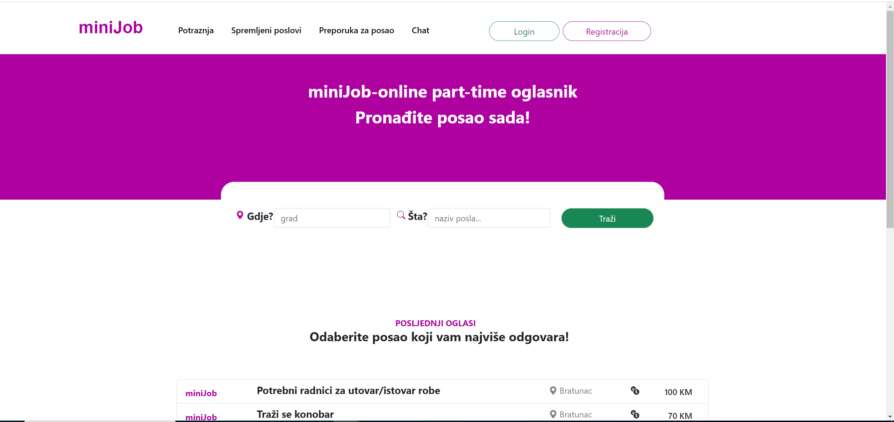
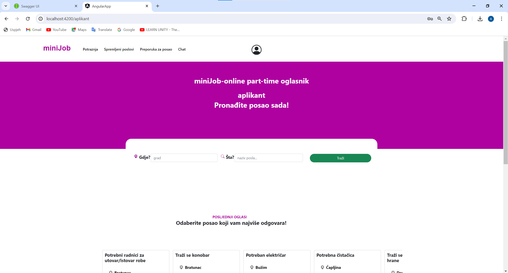
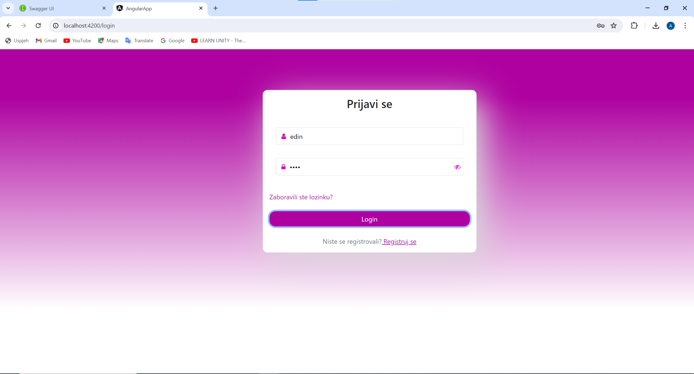
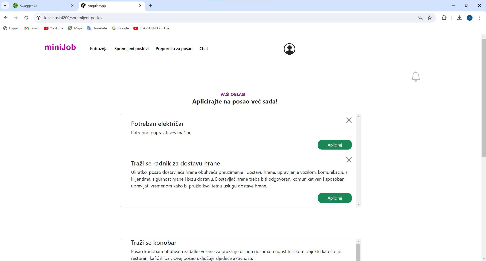
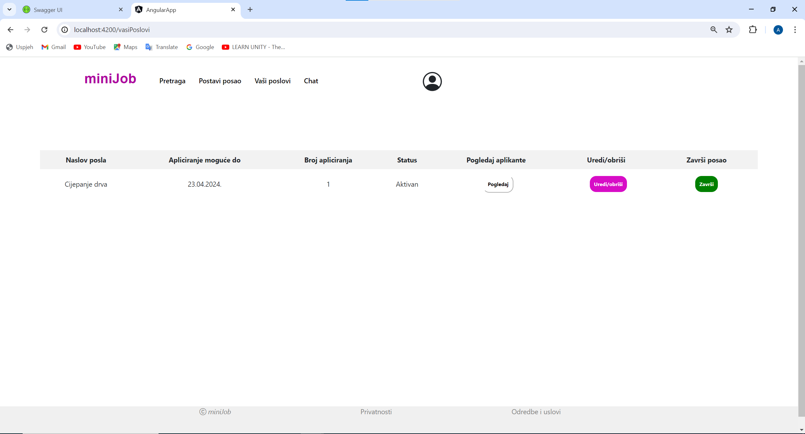
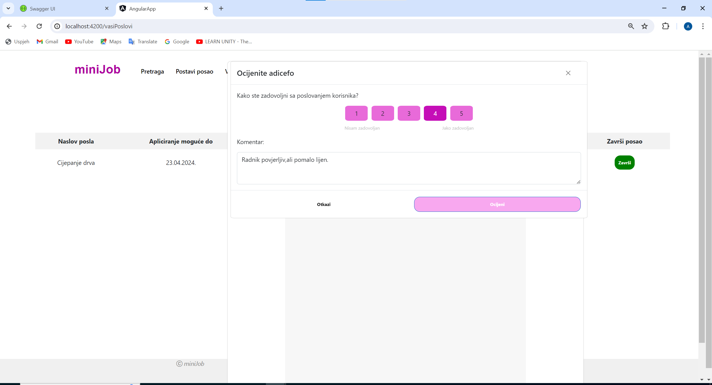
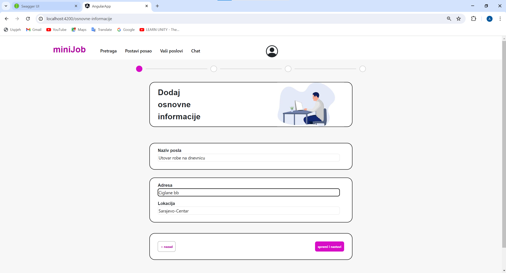

# miniJobs

### Faculty project for "Razvoj Softvera I" subject

## App description

Mini jobs is a web application that used as an advertisment for part-time jobs. The main goal of application is to easily connect applicants(espacialy students) who seek job and
employers who need someone to finish their job. After job is finished they are both obliged to rate each other as a affirmation of successful linkage.

## Tehnologies used

- ASP.NET CORE
- Angular
- Microsoft SQL Server
- SignalR library

## Created and developed

- [Mahir Topčić](https://github.com/topcic)
- Adi Ćefo

## App preview

 

 
 
 
 

 

